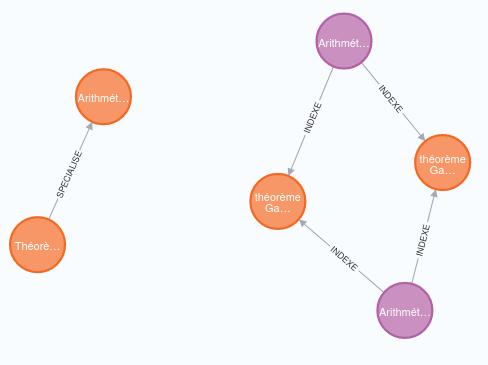

Dans la base en graphe, il est possible que plusieurs noeuds représentent un même objet.

Par exemple le Théorème de Gauss est représenté par trois noeuds de label `Concept`.

    {
    "identity": 223,
    "labels": [
        "Concept"
    ],
    "properties": {
        "date": "2023-05-13T04:58:09.164000000Z",
        "litteral": "théorème de Gauss",
        "typeConcept": "index Latex",
        "discipline": "mathématique"
    },
    "elementId": "223"
    }

---

    {
    "identity": 241,
    "labels": [
        "Concept"
    ],
    "properties": {
        "date": "2023-05-13T04:58:16.726000000Z",
        "litteral": "théorème de Gauss",
        "typeConcept": "index Latex",
        "discipline": "mathématique"
    },
    "elementId": "241"
    }

---

    {
    "identity": 2603,
    "labels": [
        "Concept"
    ],
    "properties": {
        "date": "2000-01-01T00:00:00Z",
        "litteral": "Théorème de Gauss"
    },
    "elementId": "2603"
    }

Les deux premiers noeuds (`"typeConcept": "index Latex"`) sont récents et ont été créés par un script de maintenance à partir des sources LateX de 2 documents de cours. Un des documents porte sur l'arithmétique dans l'anneau des entiers relatifs, l'autre sur l'arithmétique dans l'anneau des polynômes. La relation dans la base en graphe est de type `INDEXE`.

Le troisième noeud est plus ancien. Il représente aussi le concept du théorème de Gauss (noter le T majuscule dans le libellé). Il est relié au concept plus général d'aritmétique. Le type de la relation est `SPECIALISE`.

Cette situation indique une erreur dans le script de maintenance des documents de cours.
Lorsqu'un index figure dans un document, le script devrait vérifier si un concept dont le libellé est l'index existe dans la base. Si c'est le cas, ne pas recréer le concept et relier le document avec l'existant.

Après avoir réparé cette erreur, il faudra repèrer tous les doublons et les identifier.
